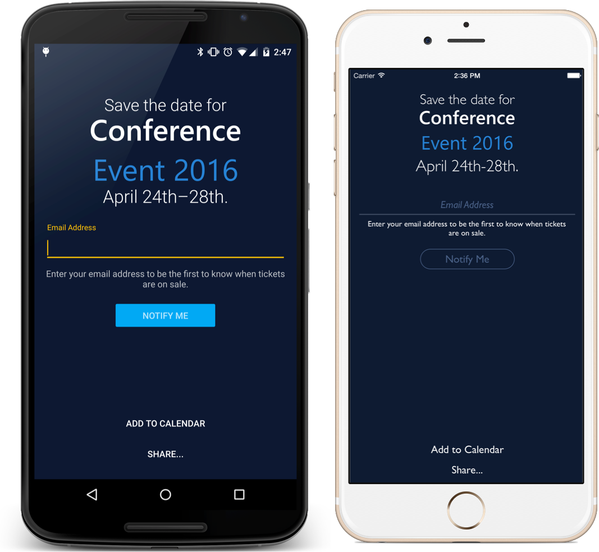

Save The Date
=============

This pre-built template enables you to easily allow attendees of your conference to register for notifications of your upcoming event. They can easily add the event to their calendar and share it with their friends. 

## Customization
Simply update the **RegisterForNotifications** method in SaveTheDateHelper.cs to register the user's email address in your backend system. Then just update your events name, logo, and date! 

This mobile app is brought to you by your friends at [Xamarin](http://www.xamarin.com/).

### Authors:
- [James Montemagno](http://github.com/jamesmontemagno): [Twitter](http://twitter.com/jamesmontemagno) | [Blog](http://motzcod.es)
- [Mike James](http://github.com/MikeCodesDotNet): [Twitter](http://twitter.com/mikecodesdotnet) | [Blog](http://mikecodes.net)
